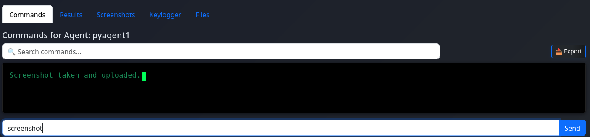

# C2 Framework Demo

This file showcases the C2 framework in action, including the web interface, Python agents, file download feature, and Docker container status.

---

## C2 App Home Page

- Shows specific C2 feature (e.g., commands panel, agent interaction)
- Highlights how users interact with the app

---

##  Python Agent COMMAND Output

- Shows a running Python agent
---

##  SCREENSHOT COMMAND AND  Output

---

##  File Download Feature

- Example of downloading a file via the framework
- Demonstrates file transfer feature in action

---

